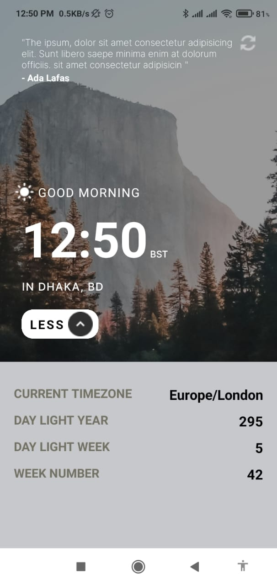

# Time Application

## Introduction

The "N Time Location" application is a React Native project built using Expo. It displays the current time, location, and additional dynamic content. The application is divided into three main sections:

1. **Proverb Section**: Displays a random proverb.
2. **Time and Location Section**: Shows the current time and location, along with some icons and dynamic buttons.
3. **Details Section**: Provides detailed information about the location and a list of years, which dynamically changes based on the second section's button interactions.

## Features

- Displays the current time and updates it in real-time.
- Fetches and displays the user's current location.
- Shows a random proverb each time the app is opened.
- Interactive UI with dynamic buttons that change the content in the third section.
- Clean and reusable components with well-structured styles.

## Screen shots



## Technologies Used

- React Native
- Expo
- React Native Geolocation Service
- TypeScript
- Styled Components

## FOLDER structure

```

│ ├── node_modules
│ ├── components
│ │ ├── Home.tsx
│ │ ├── DetailsComponent.tsx
│ ├── assets
│ │ ├── app
│ │ │ ├── arrow-down.png
│ │ │ ├── arrow-up.png
│ │ │ ├── light-bg.png
│ │ │ ├── refresh.png
│ │ │ ├── sun.png
│ │ ├── adaptive-icon.png
│ │ ├── favicon.png
│ │ ├── icon.png
│ │ ├── splash.png
│ ├── styles
│ │ ├── styles.ts
│ ├── App.tsx
│ ├── babel.config.js
│ ├── package.json
│ ├── tsconfig.json

```

## Learned Concepts

- How to set up and use Expo for React Native projects.
- Fetching and displaying real-time data (current time and location).
- Managing state and props in React Native.
- Creating reusable components.
- Styling in React Native using StyleSheet and styled-components.
- Handling user permissions for location services.
- Dynamically updating UI based on user interactions.


